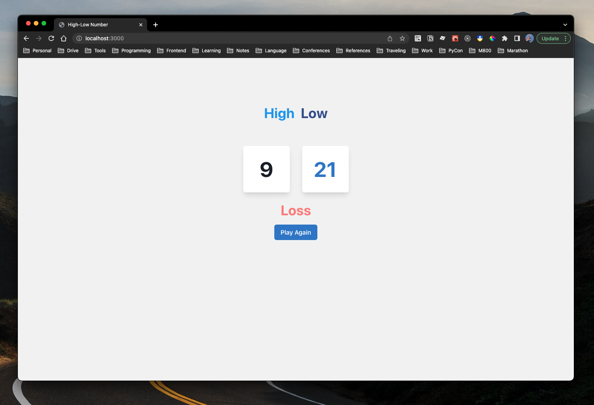

# High-Low Number Guessing



This repository is a game of guessing number higher or lower, which is implemented in React and TypeScript. 🚀

> HINT: If you have any questions, please feel free to ask me.

## Rules

- The number A and B are always randomly generated between 1 - 99
- When B > A and user chose `Higher`，the game result is WIN
- When B > A and user chose `Lower`，the game result is LOSE
- When B < A and user chose `Higher`，the game result is LOSE
- When B < A and user chose `Lower`，the game result is WIN
- When B = A and user chose `Higher`，the game result is LOSE
- When B = A and user chose `Lower`，the game result is LOSE

---

## Description

### Execution

1. To run this demo, you need to clone the project first.
  ```bash
  $ git clone https://github.com/yungshenglu/HighLowNumber
  ```
2. After cloning, change the your current directory into the repository and setup the project
   ```bash
   $ cd HighLowNumber/ & yarn install
   ```
   - The command `yarn install` will install some necessary packages for this project
   - It will take few second for running above command
3. Compiles and hot-reloads for development
   ```bash
   $ yarn start
   ```
   - It will take few second for running above command
   - You won't get any error messages if running successful
4. Congratulation! you can open your browser to `http://localhost:3000` and see our HighLowNumber

---

## Contributor

> NOTICE: You can follow the contributing process [CONTRIBUTING.md](CONTRIBUTING.md) to join me. I am very welcome for any issue!

- [David Lu](https://github.com/yungshenglu)

---

## License

[WTFPL](LICENSE)
